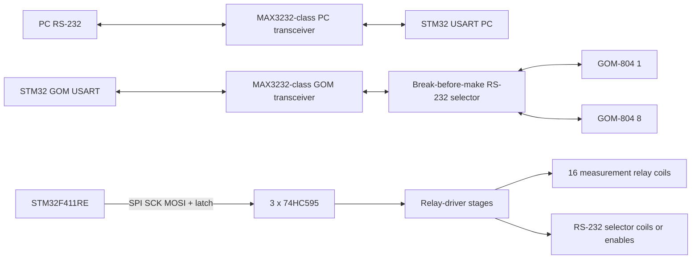
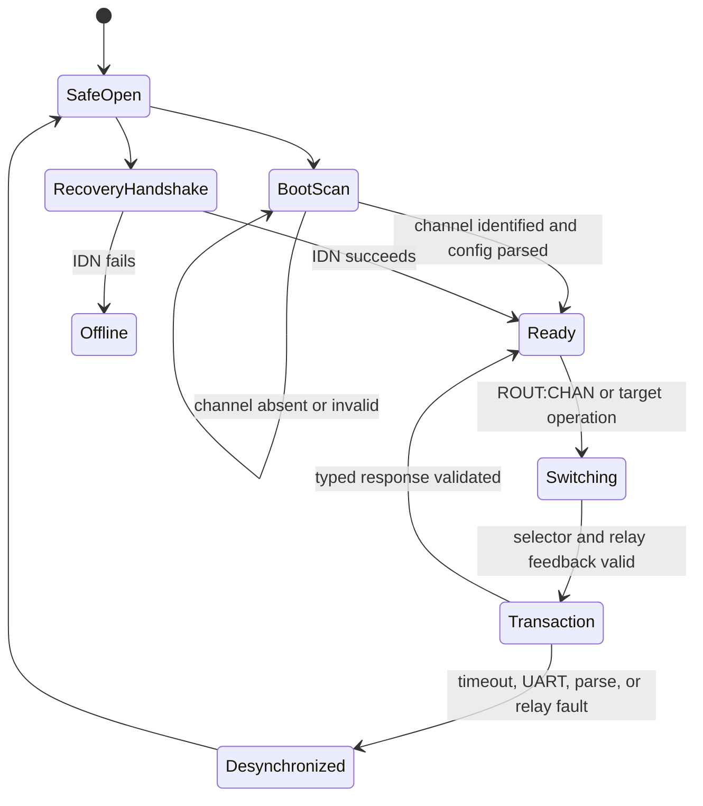

# Revised GOM-804 router design

## Decision and safety gate

- The production target is **STM32F411RE, LQFP64**. `Source/Source.ioc` is currently configured for STM32F401, so its MCU/pin/peripheral configuration must be corrected in the legacy CubeMX GUI and regenerated before firmware integration. Do not hand-edit the `.ioc` or generated initialization code.
- The proposed shared RS-232 wiring is not electrically valid as a selectable bus. Closing relays that only connect GOM measurement terminals does **not** isolate a GOM's RS-232 TX output. With eight GOM TX outputs tied together, a query can produce contention/corrupted replies from all units. Firmware cannot correct this.
- Add an independently controlled, break-before-make RS-232 selector. It must connect both directions of exactly one link (router TX → selected GOM RX and selected GOM TX → router RX), leave every GOM disconnected at reset/fault, and retain a common reference only if permitted by the RS-232/ESD design. Implement it with an RS-232-rated analog/crosspoint switch or relay topology verified for the actual voltage, baud rate, and ESD environment. The selector must not reuse measurement contacts unless the chosen relay provides enough isolated poles and contact ratings for both functions.
- Keep the two measurement-contact relays per GOM independent. The 74HC595 chain must therefore provide at least 16 measurement outputs plus RS-232-selection control and output-enable/fault control. Use three daisy-chained 74HC595 devices (24 outputs) unless the schematic implements a separate decoder/driver. A 595 output drives only a 3.3-V-compatible relay driver, never a relay coil directly.

## Firmware architecture

1. Retain `gom_router` as the PC-SCPI validation and command-mapping layer. Keep the rule that PC input never becomes unrestricted GOM SCPI text.
2. Replace the single blocking transaction flow in `App/gom/gom_firmware.c` with a `gom_manager` state machine that is the sole owner of the GOM UART, measurement relay matrix, RS-232 selector, RX purge, timeout, and operation completion.
3. Make `ROUT:CHAN <1..8>` a physical operation: open measurement and serial selectors, wait break time, verify all-off, select the requested serial route and measurement relay pair in their required order, wait settle time, verify feedback, purge UART RX, then publish the selected channel. `ROUT:OPEN:ALL`, `*RST`, link fault, watchdog fault, and selector fault all return the complete matrix to safe-open.
4. Add one explicit state record for each GOM: configured/present state, parsed identity (model, serial, firmware), cached supported settings, configuration-read result, communication fault count, and desynchronization/offline state. A selected channel is usable only after its initial identification/configuration sequence succeeds.
5. At boot, force 595 OE/relay drivers disabled, shift and latch an all-off image, initialize the UARTs, then process channels 1–8 sequentially. For each channel select the **serial route and its measurement relay pair** as confirmed by the user, purge RX, query `*IDN?`, read the whitelisted configuration query set, parse/cache results, and open all routes before the next channel. A timeout, malformed line, or unsupported response marks only that channel offline and proceeds to the next one. Do not claim to load settings that cannot be read back using a verified GOM command.
6. On any query timeout, UART error, oversize/malformed response, or selector error, open all relays, invalidate the affected channel cache, mark it desynchronized, drain/purge RX, and require a fresh IDN handshake before later use. Late replies must never complete a new request.

## 74HC595 and relay implementation

1. Add a board-owned shift-register adapter, for example `App/board/board_shift_register.c/.h`, using an STM32 SPI peripheral for SCK/MOSI and one GPIO latch line. Keep OE hardware-disabled with a pull resistor while reset/boot occurs; assert output enable only after an all-off frame has been clocked and latched. Keep MR at its inactive polarity with hardware biasing.
2. Move all relay bit mapping to one board configuration table. Define the exact 24-bit mapping for 16 measurement contacts, serial-selector controls, OE, and reserved bits. Build a full output image in RAM and commit it atomically by SPI shift plus latch pulse; never change individual output pins directly.
3. Update `App/relay/relay_matrix.c/.h` to represent a channel as its two required measurement-relay bits, rather than the current one-bit mask. Add a separate serial-selector abstraction or combined route transaction so the serial and measurement paths cannot be mismatched.
4. Preserve break-before-make at each selection transition. Add independent feedback where hardware provides it. If feedback cannot be fitted, document this as a residual safety limitation and use an OE/fault-latch hardware path so a firmware reset cannot leave a relay energized.
5. Update `App/board/board_config.h`, `App/board/board_io.c/.h`, and remove direct PB3/PB4/PB5/PB6/PB7/PB8/PB12/PB13 relay control after the shift-register mapping is in place. Avoid SWD/JTAG-reserved/debug-sensitive pins unless the regenerated CubeMX configuration proves they are available.

## PC protocol and measurement validation

1. Change router errors to a real FIFO-backed SCPI error queue. `SYST:ERR?` pops the oldest error; `*TST?` reports latched critical hardware faults. Keep one command per message and return no raw GOM response if parsing/validation fails.
2. Make command writes verified writes. For every multi-step configuration plan such as `CONF:RES`, execute its fixed sequence, query `SYST:ERR?` or a supported read-back value, update the cache only after verification, and return a partial-apply SCPI error if any step fails.
3. Add typed response parsers for IDN, double, integer/boolean, enum, and GOM error response. Strictly reject empty, trailing-garbage, non-finite (`NaN`/`Inf`), overflow, wrong-format, or overlength inputs/responses.
4. For `READ?`, classify `+9.0000E+9` as over-range and `+9.9999E+9` as HVP before normal numeric processing. Parse normal resistance in ohms, compare it against the configured lower/upper limits for the selected channel, and return the normal numeric response only for an in-range result. Out-of-range, sentinel, offline, relay interlock, or communication cases are emitted as queued SCPI errors with stable router error codes rather than being forwarded as measurement values.
5. Define PC commands for per-channel compare limits and readback. Store limits in a router configuration structure; decide whether they are volatile or persisted in STM32 Flash only after the boot-source requirement is separated from the GOM's own read configuration. Do not write Flash on every measurement.

## CubeMX, electrical, and build updates

1. In legacy CubeMX, select STM32F411RE LQFP64, configure the two required USARTs, selected SPI instance, latch/OE/feedback GPIOs, clocks, NVIC, and DMA only after checking pin collisions. Regenerate the project and review generated-file diffs. Do not manually edit `SystemClock_Config()` or generated HAL initialization.
2. Update the hardware design document and pinout document with the final F411RE pin assignment, relay-driver part number, coil supply/current budget, flyback suppression, OE/reset behavior, 74HC595 supply level, RS-232 transceivers, RS-232 selection method, ESD/TVS, and test points.
3. If 74HC595 runs at 5 V, use 74HCT595 or level translation. A 3.3-V STM32 output is not guaranteed to meet a 5-V 74HC595 input-high requirement.
4. Build with the project CMake preset after generation and resolve any target or HAL differences caused by the F401-to-F411 conversion.

## Tests and acceptance criteria

1. Extend `tests/host/test_router.c` with strict numeric parsing, NaN/Inf rejection, limit boundary tests, read sentinel classifications, error FIFO behavior, and IDN parsing.
2. Add host tests for all eight 16-bit measurement masks, serial-selector mapping, no-overlap selection, break-before-make ordering, boot scan success/offline/malformed response, verified-write failure, response timeout, delayed response discard, and recovery handshake.
3. Update `tools/gom_simulator.py` to emulate eight independently selectable GOMs, identity/configuration replies, normal/LO/HI readings, over-range/HVP sentinels, timeout/offline behavior, and invalid responses.
4. Hardware-in-the-loop acceptance requires: all relay outputs off through reset/brownout; selecting each channel connects only that GOM's RS-232 path; no RS-232 contention; all other measurement contacts open; correct configuration cache for every present GOM; correct in-range/out-of-range/HVP PC SCPI behavior; and safe-open recovery after unplugging a GOM or injecting an invalid response.

## Files to modify

- `Source/Source.ioc` through the CubeMX GUI followed by regeneration, plus generated files only through that process
- `App/board/board_config.h`
- `App/board/board_io.c`
- `App/board/board_io.h`
- New board shift-register adapter files under `App/board/`
- `App/relay/relay_matrix.c`
- `App/relay/relay_matrix.h`
- `App/gom/gom_firmware.c`
- `App/gom/gom_firmware.h`
- `App/gom/gom_router.c`
- `App/gom/gom_router.h`
- `App/gom/gom_command_encoder.c`
- `App/board/protocol_limits.h`
- `tests/host/test_router.c`
- `tools/gom_simulator.py`
- `GOM_850_HARDWARE_DESIGN.md`, `GOM_850_ROUTER_DESIGN.md`, and `stm32_pinout.md`
